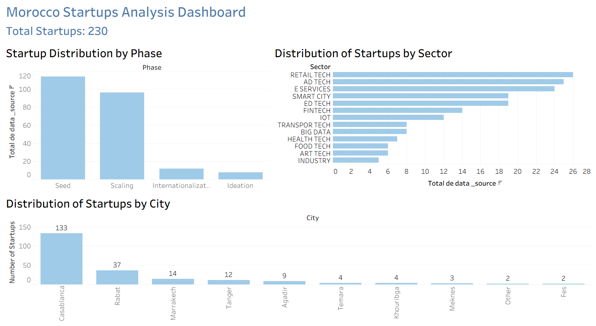

# 📊 Morocco Startups Analysis Dashboard

This project analyzes the Moroccan startup ecosystem using Tableau.

## 📸 Dashboard Preview

## 📌 Project Overview
This dashboard provides insights into:
- Startup distribution by phase
- Startup distribution by sector
- Top cities with the most startups
  
## 📂 Data Source
-The dataset used in this project comes from:
 Agence de Développement du Digital (ADD) - Open Data

🔗 Source:
https://data.add.gov.ma

## 🔍 Key Insights
- Most startups are in the Seed and Scaling phases
- Casablanca dominates the startup ecosystem
- Tech sectors (Retail, AdTech, FinTech) are leading

## 🛠 Tools Used
- Tableau
- Excel

## 📫 Contact
- LinkedIn: https://www.linkedin.com/in/achraf-hosayn
